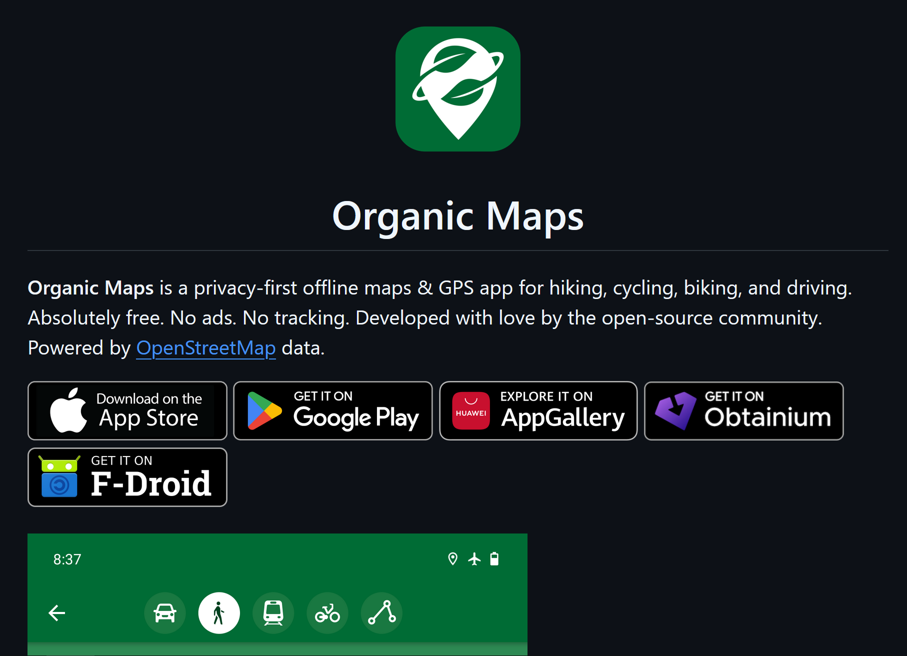

我逐渐有些关于隐私的被害妄想，总感觉自己的定位信息或者输入法的记录会被软件厂商拿去为非作歹。所以我把输入法换成了Rime和Fcitx5，放弃豆瓣去用NeoDB。虽然听我搞科研的同学说，能跟一些厂商买到多少多少万人的日常起居通勤的GPS数据……但我其实也相信这样的数据是会抹掉敏感信息的，所以很难说这样的倒卖泄露隐私真的对我的日常生活有什么影响。

不过我还是有些心里过不去，就这样让自己的定位信息泄露，便宜了任何可能从中得利的群体，都会让我十分不甘心。所以我开始尽量非必要不打开手机的GPS，这样如果要获取我的定位，那大部分情况下只能通过通信基站或者Wi-Fi这样的东西来获得我一个大概的位置了，这样的结果算是我大致能接受的。

## 地图软件不登录账号也许是个好办法

可是还是有不得不开启GPS定位的情况，比如就是用导航软件的时候。而我的被害妄想告诉我，确实应该提防地图软件，虽然我没有任何证据——不过我要是能因此就不再疑神疑鬼，那我早就能放下对本地开源软件的执着了。

（不过我也许需要事先声明一下，我是一个基本上只依赖公共交通出行的学生党，我完全没有开车导航的需求，我后面的奇怪操作可能对开车出行的人完全没用……）

我自己一拍脑门想出来的，在最小的程度上能够有所防备的操作是，手机常备两个地图软件，一个不登录账号一个登录账号：不登录账号的用来日常使用，登录账号的以备不时之需。这样由于日常使用的是不登录账号的地图软件，那么这些地图软件的厂商按道理来说应该不容易获取我比较多的位置信息。不过这样操作还是会有比较痛苦的问题，比如app会不断弹出登录提醒，以及可能会有开屏摇一摇广告。

如果你不能容忍这种程度的不便，那其实可以关掉这个帖子了；如果你能容忍这种程度的不便，我觉得到这里为止，已经算是我能给到的对日常生活影响最小的建议了。

## 开源地图软件？可能还行，但还行似乎不大可能

我在F-Droid这个安卓的开源应用商店上随便用map关键字进行搜索，发现了[Organic Maps](https://github.com/organicmaps/organicmaps)这个软件，看起来是个很良善的软件，标榜自己不会tracking，听起来不错。

但是用起来就是另一回事了。这个软件用的数据源是OpenStreetMap，是在海的另一边的贡献者们不断上传更新的数据库，显然数据就很难很好地支持在海的这一边的我们。所以当我下载下来这里的本地数据，兴冲冲地想开始第一次导航的时候，我发现完全搜索不到我想要去的地点。我的情绪落到了谷底。

一点碎碎念，虽然像是商店、餐厅之类的POI（Point of Interest）的更新不会很及时，但是道路或者地铁线路或者公共交通线路这方面，OpenStreetMap应该还是相对比较值得信任的，及时道路会有更新，在不那么微观的尺度上它还是可以保证相对的准确，因此在科研方面应该还是挺好用的。

那么要怎么解决这个问题呢？我的大致想法是，有条件地妥协，向高德百度这类的地图服务提供商获取目标点位的经纬度数据，然后带着数据回到Organic Maps里面（Organic Maps是支持直接粘贴经纬度作为目标的，不过是纬度在前经度在后中间用逗号隔开这样的形式），再进行导航。然后这里就有两个问题，一个是怎样获得目标的经纬度坐标，一个是这个经纬度坐标需要进行一定的处理。

## 我做工具来补足Organic Maps在国内做不到的事？真的假的

我想先说经纬度坐标的处理，因为这块是不那么技术的（大概吧），主要是出于安全考虑，我们日常使用的地图软件里的坐标，跟正常的经纬度坐标是有一定偏移的，常用的经纬度坐标系叫作wgs84，像Google Maps或者这个Organic Maps就在使用这个坐标系，而高德地图的坐标系是gcj02（gcj应该是国测局的首字母），百度地图的坐标系是bd09，其中的演化路径大概是wgs84加密了一层变成了gcj02，再加密一层就变成了bd09。

我们已知高德地图或者百度地图掌握着比较多的商家点位信息，即使我们从这些厂商手里拿到了经纬度坐标的数据，我们仍然需要转换成wgs84才能导入到Organic Maps中被使用，这就是我说的需要对坐标进行处理。

可令人遗憾的是，bd09和gcj02是可以互转的，但wgs84到gcj02就是一个，至少是我们外界看来不可逆的转换，当然其实很容易搜到这样的转换代码，比如[这里](https://github.com/googollee/eviltransform)。但是这样的转换代码也只是让我们拿到的gcj02的坐标，尽可能地转换到逼近wgs84的坐标。

剩下的就是从地图软件厂商那里获取数据了，如果要举例子的话，可以参考百度地图的这样一个[示例的网站](https://lbsyun.baidu.com/webapi/demo-center?serviceid=15)，在上面的搜索框中输入地名，就会返回经纬度坐标。这样的一个网页，应该就是百度地图期望的，用户能用API制作出来的东西。

那么具体要怎么做呢？我其实去到了高德地图的[相关API文档页面](https://lbs.amap.com/api/javascript-api/guide/services/autocomplete)（用高德的原因大概是，想要转到wgs84那当然是用高德的gcj02比较接近），利用给出的示例，创建一个HTML，然后开始鞭笞AI给我好好读文档，写出一个让我满意的应用，没错，说了这么一大通我也还是鞭笞AI来做工作（逃。

这里其实可以插一句，最开始我是想避开这些地图软件厂商，怎么我现在又开始用起来他们的服务了呢？我只能狡辩为，我这种又妥协又折腾还是有意义的——直接用软件那是把自己所有的位置信息都供给了地图软件厂商，而我现在这通折腾，只是向厂商发送了我的一个对于目标点位的位置的需求，虽然包含我个人的API key能精确判断是我发出的请求，但是结合不了具体的定位，那能利用的数据量其实很少，我要是就查查看而不真的去呢？这样想来就能为我的这一通操作正名了。

所以我其实只想做一个轻量的HTML工具，而在这样的工具里，获取了目标点位的经纬度坐标、实现坐标转换。如果这时候能有个快速跳转那可就太好了。不过好在Organic Maps是提供了[这样的API的](https://omaps.app/api)，实现起来也并不复杂。

  

## 什么你说我还不如不折腾呢？我不吉岛啊

在做完这样的工具之后，我意识到，前面那个似乎更适合步行导航，因为步行的时候没有很急迫的时间需求，同时这样的工具不适合公共交通的原因，我会想到比如Organic Maps没法很好地告诉我地铁出站口，或者我还非常担心公交站牌可能有位置变更之类的，总之我发现似乎我还需要一个小工具，来把公共交通的信息整理好。

实际上这也是我在有这些过剩的隐私意识之前，就一直想做的事。我一直很纠结在地图软件里查好公共交通路线后，要不要一直开着定位并把地图软件留后台呢？如果一直开定位，感觉是徒增功耗以及占用后台内存；直接杀掉后台我又常常会忘记该哪站下车；如果关掉定位，这些软件还会来回地弹弹窗让用户打开定位，真的让人很苦恼。而我想到的是，当我大部分时间已经在公共交通上的时候，定位按道理来说根本就没有意义，我只想知道哪站下、还有几站下、下车之后倒什么车，之类的问题，只有当我下车之后需要步行一段距离换乘或者最后移动到目的地的时候，定位才有意义，而为了这一星半点的时间，我要整个把app留在后台或者一直开着定位，真的有些别扭。

（所以这里又能印证一开始我说过的，我的这些折腾不适合开车这样的需求，开车就是需要一直定位，确认自己还在正确的路上。）

写到这里我其实有些累了，也确实感觉没有什么可以再继续讲的了，公交线路的规划，无论是高德还是百度地图都会提供[API接口](https://lbs.amap.com/demo/javascript-api-v2/example/bus-search/bus-data)，而且能返回非常丰富的信息。我的思路就是，把跟公共交通相关的信息提取出来，比如要坐多少站、哪站下车这样的信息，而需要走路的部分，我把起终点提取出来，制作成跳转链接快速跳到Organic Maps这样的软件里面。

不过这里其实也有一个预设是，不会太路痴、能接受没有太多的定位辅助、而通过仅仅看信息并不完备的地图，就已经能够满足自己的寻路需求。说到底在国内使用Organic Maps就是这样，要考验用户能不能正常使用一个信息不完备的地图app。我自己是比较能接受的，毋宁说我更倾向于大多数时候关掉定位，仅仅通过看地图来判断要怎么抵达目的地，当然这可能因为我还是学生，没有那么多急事，也可能是我习惯于提前抵达，留出的时间余裕，正好允许我进行这样的探索。

这两个HTML的页面小工具我都放在了[GitHub](https://github.com/sToney239/OrganicMapsBusAssistant)，其中search-location.html是前一个工具，bus-route-planning.html是后一个工具，这两个都无法直接使用，需要找到其中的「your own API key」字样并替换成你的API key，至于怎么获取这样的key可以在网上用关键词简单地搜索应该就能做到。【补记】目前两个页面的功能已经进行了合并，具体使用方法请参见GitHub页面中的Readme文件。

如果你要问我，我这通折腾难道不是更多的妥协吗，那我必须承认，是这样的，我就是利用这些地图软件厂商提供的公共交通规划，来补全Organic Maps的不足。甚至对比我最初的那个不登录软件的策略，现在可能倒退得更多。不登录软件的话，地图软件厂商可能很难确定到我这样一个用户，可是我现在反而是一直在用个人的API key告诉厂商我可能就是有这样的出行需求，我就在这附近的什么地方……

不过也不是一无所获的，仅仅从我最后得到的这个公交线路的小应用，即使是脱离Organic Maps，或者脱离其他的地图软件，单独使用，也会让我感到满意。因为它的的确确解决了我一直以来的困扰。也许我在虚空地冲向风车敌人，也许我是因为有在让石块离山顶稍稍近了一点而确认自己是幸福的。

## 最后

这一通的折腾，其实让我回忆起之前的一些思考，公共交通（可能公交会稍好一点，而地铁可能会更明显一点）会让人的移动，在感觉层面脱离于实际的三维世界，而只是停留在一站又一站的线路上的站名。所以我可以对地图软件做这样的精简，因为乘坐公共交通的人本身就不在乎。但这样听起来非常可疑又可悲，这样似乎完全阻隔了与世界本应有的连接，我是说如果我是步行/骑车/自驾，那我本应实打实地穿过那些土地、本应对有更多的实感、本应有机会与土地上的人有更多的连接。

不过也无所谓了，我已经是一个城市中的原子化的人了，已经与周围建立的连接足够少了，也不差这一星半点了。

